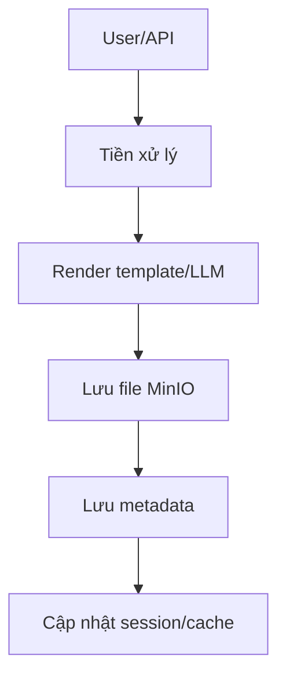

# Contract Creation Pipeline

## 1. Tổng quan
Pipeline tạo hợp đồng (contract) chịu trách nhiệm toàn bộ luồng tạo, lưu trữ, và quản lý hợp đồng số hóa, bao gồm:
- Tiếp nhận yêu cầu tạo hợp đồng từ user (qua API/giao diện).
- Tiền xử lý, chuẩn hóa dữ liệu đầu vào.
- Sinh hợp đồng (từ template hoặc LLM).
- Lưu file hợp đồng (MinIO/local).
- Lưu metadata vào PostgreSQL.
- Cập nhật session, audit, cache.

## 2. Các bước chi tiết
### 2.1. Tiếp nhận yêu cầu
- API nhận request gồm: user_id, session_id, thông tin hợp đồng, file đính kèm (nếu có).
- Xác thực user, enforce quota.

### 2.2. Tiền xử lý
- Chuẩn hóa dữ liệu, validate thông tin bắt buộc.
- Mapping các trường hợp đặc biệt (ví dụ: loại hợp đồng, điều khoản).

### 2.3. Sinh hợp đồng
- Nếu có template: render template với dữ liệu user.
- Nếu không: sinh hợp đồng bằng LLM (vLLM) theo prompt đặc thù.
- Sinh file PDF/Word/Markdown.

### 2.4. Lưu file hợp đồng
- Lưu file lên MinIO (bucket contract) hoặc local.
- Sinh path, lưu checksum.

### 2.5. Lưu metadata
- Lưu record vào bảng contract (PostgreSQL): user_id, session_id, path, name, created_at.
- Cập nhật session (nếu có liên kết).

### 2.6. Audit & cache
- Ghi log audit (nếu bật).
- Cập nhật cache session/history.

## 3. Thành phần chính
- FastAPI backend: orchestrator.
- MinIO: lưu file hợp đồng.
- PostgreSQL: lưu metadata contract, session.
- Redis: cache session/history.
- vLLM: sinh hợp đồng tự động (nếu không có template).

## 4. Sơ đồ pipeline

