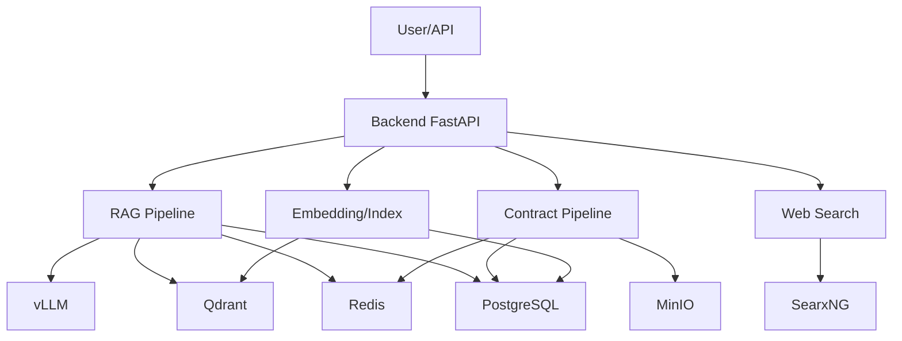

# Tổng Quan Pipeline Toàn Hệ Thống

## 1. Kiến trúc tổng thể
Hệ thống chia thành các pipeline chính:
- RAG (Retrieval-Augmented Generation)
- Contract Creation
- Web Search
- Embedding/Indexing
- Lưu trữ file (MinIO)
- Quản lý session/history

## 2. Dòng dữ liệu chính
### 2.1. User Query → RAG
- User gửi câu hỏi → API → Tiền xử lý → Truy xuất history/semantic → Truy vấn web (nếu cần) → Tổng hợp prompt → vLLM → Trả lời → Lưu history/semantic → Cập nhật cache.

### 2.2. User tạo hợp đồng
- User gửi yêu cầu → Tiền xử lý → Render template/LLM → Lưu file MinIO → Lưu metadata → Cập nhật session/history.

### 2.3. Upload file tài liệu
- User upload file → Tiền xử lý → Chunking → Embedding → Lưu Qdrant → Lưu metadata → Cập nhật cache.

### 2.4. Web Search
- User yêu cầu search → Gọi SearxNG → Chuẩn hóa evidence → Ranking → Trả về evidence.

## 3. Thành phần hệ thống
- FastAPI backend: điều phối pipeline, API.
- vLLM: sinh ngôn ngữ tự nhiên.
- Qdrant: lưu embedding, semantic retrieval.
- Redis: cache, rate limit, session/history.
- PostgreSQL: lưu session, history, contract, semantic_history.
- MinIO: lưu file hợp đồng, tài liệu.
- SearxNG: web search evidence.

## 4. Sơ đồ tổng thể

## 5. Đặc điểm nổi bật
- Tách biệt pipeline, dễ mở rộng.
- Tối ưu truy vấn, cache, semantic retrieval.
- Audit, logging, metrics đầy đủ.
- Có regression, smoke test, backfill tự động.
