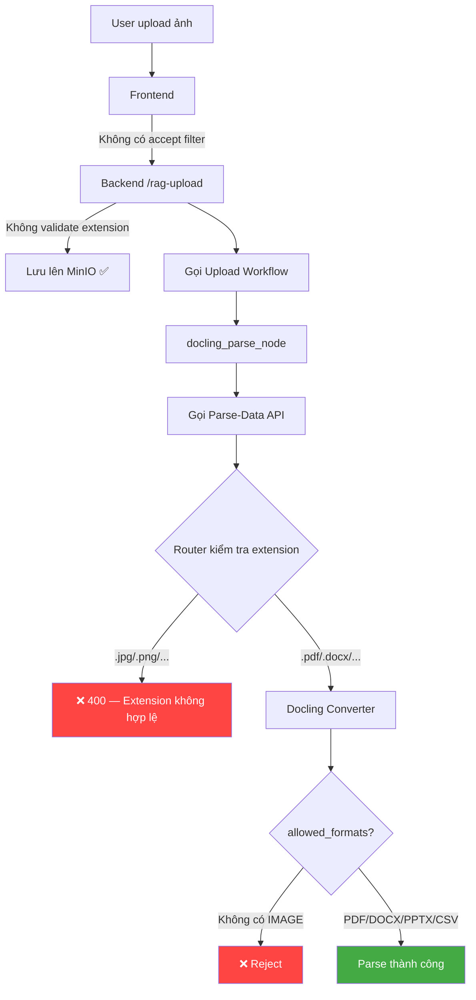

# 📸 Phân tích: Hệ thống có hỗ trợ parse ảnh không?

## Kết luận nhanh

> [!CAUTION]
> **KHÔNG** — Hệ thống hiện tại **hoàn toàn không hỗ trợ parse ảnh**. Có ít nhất **5 điểm chặn** trải dài từ parse-data service, backend upload pipeline, đến frontend UI.

---

## 1. Parse-Data Service — Các điểm chặn

### 1.1. Docling Config — Tắt image generation

File: [docling_config.py](file:///home/ntcai/RAG_Chatbot/RAG_Chat/parse-data/src/config/docling_config.py#L37-L41)

```python
pipeline_options = PdfPipelineOptions()
# Tắt generate ảnh — không cần cho markdown output, tiết kiệm RAM đáng kể
pipeline_options.generate_page_images = False
pipeline_options.generate_picture_images = False
```

| Setting | Giá trị | Ý nghĩa |
|---------|---------|---------|
| `generate_page_images` | `False` | Không tạo ảnh cho từng trang PDF |
| `generate_picture_images` | `False` | Không trích xuất hình ảnh nhúng trong PDF |

> [!NOTE]
> Đây chỉ liên quan đến **ảnh bên trong PDF**. Khi parse PDF, Docling sẽ bỏ qua mọi hình ảnh và chỉ trích xuất text/bảng.

### 1.2. Docling Config — `allowed_formats` chỉ hỗ trợ document

File: [docling_config.py](file:///home/ntcai/RAG_Chatbot/RAG_Chat/parse-data/src/config/docling_config.py#L46-L56)

```python
converter = DocumentConverter(
    allowed_formats=[
        InputFormat.PDF,
        InputFormat.DOCX,
        InputFormat.PPTX,
        InputFormat.CSV,
    ],
    ...
)
```

**Không có** `InputFormat.IMAGE` trong danh sách → Docling converter sẽ **từ chối** file ảnh ngay ở bước convert.

### 1.3. Parse Router — Extension whitelist chặn ảnh

File: [parse_router.py](file:///home/ntcai/RAG_Chatbot/RAG_Chat/parse-data/src/router/parse_router.py#L23-L24)

```python
ALLOWED_EXTENSIONS = {
    ".pdf", ".docx", ".doc", ".pptx", ".ppt", ".csv"
}
```

Không có `.jpg`, `.jpeg`, `.png`, `.gif`, `.bmp`, `.tiff`, `.webp` → Router trả về **400** trước khi file ảnh đến được service.

### 1.4. Test Upload Page — Chỉ accept PDF

File: [main.py](file:///home/ntcai/RAG_Chatbot/RAG_Chat/parse-data/main.py#L116)

```html
<input type="file" id="fileInput" multiple accept=".pdf">
```

Trang test upload chỉ cho chọn `.pdf`.

---

## 2. Backend Upload — Phân tích

### 2.1. Upload Endpoint (`rag-upload`) — **Không chặn file type**

File: [rag_controller.py](file:///home/ntcai/RAG_Chatbot/RAG_Chat/backend/controller/rag_controller.py#L676-L717)

```python
@router.post("/rag-upload")
async def rag_upload_controller(
    files: list[UploadFile],
    session_id: int = Form(0),
    ...
):
```

> [!IMPORTANT]
> Backend **KHÔNG có bất kỳ validation nào về file type/extension** ở endpoint upload. Nó chấp nhận mọi loại file.

### 2.2. Upload Service — Cũng không filter

File: [rag_service.py](file:///home/ntcai/RAG_Chatbot/RAG_Chat/backend/service/rag_service.py#L87-L268)

Upload service đọc file → gửi lên MinIO → gọi `app_upload_workflow`. Không có bước validate extension hay content_type.

### 2.3. Upload Workflow — Gọi Docling API (parse-data) → Bị chặn gián tiếp

File: [rag_upload_util.py](file:///home/ntcai/RAG_Chatbot/RAG_Chat/backend/agent_chatbot/node/util/rag_upload_util.py#L40-L77)

Workflow gọi `docling_convert()` → POST đến parse-data service (`MARKER_URL`). Nếu gửi file ảnh:
- Parse-data router sẽ trả **400** (extension không hợp lệ)
- Hoặc Docling converter sẽ **reject** (format không được phép)

→ **Kết quả**: File ảnh upload qua backend sẽ **lưu được lên MinIO** nhưng **parse sẽ thất bại**, workflow crash, không có markdown/chunks/embedding nào được tạo.

---

## 3. Frontend — UI cũng ra hint sai

File: [FileManagerModal.js](file:///home/ntcai/RAG_Chatbot/RAG_Chat/frontend/src/components/FileManagerModal.js#L238)

```jsx
<span className={styles.hint}>Hỗ trợ .pdf, .docx, .txt</span>
```

Tuy hint ghi `.txt` nhưng thực tế parse-data cũng **không hỗ trợ** `.txt` trong allowed_extensions. Và không nhắc gì đến ảnh.

> [!NOTE]
> `<input type="file">` ở frontend **không có attribute `accept`** → User có thể chọn bất kỳ file nào. Nhưng khi upload ảnh, backend sẽ nhận file → gửi parse-data → thất bại.

---

## 4. Nếu muốn hỗ trợ parse ảnh — Cần làm gì?

### Tầng 1: Parse-Data Service (Docling)

| # | Việc cần làm | File | Chi tiết |
|---|-------------|------|----------|
| 1 | Thêm `InputFormat.IMAGE` vào `allowed_formats` | `docling_config.py` | Docling hỗ trợ `InputFormat.IMAGE` cho các file `.jpg`, `.png`, `.bmp`, `.tiff` — nó sẽ chạy **OCR** để trích xuất text từ ảnh |
| 2 | Bật lại `generate_picture_images` (tùy nhu cầu) | `docling_config.py` | Chỉ cần nếu muốn **giữ lại ảnh** trong output markdown. Nếu chỉ cần OCR text thì không cần |
| 3 | Thêm extensions ảnh vào `ALLOWED_EXTENSIONS` | `parse_router.py` | Thêm `".jpg", ".jpeg", ".png", ".bmp", ".tiff", ".webp"` |
| 4 | Cấu hình OCR engine cho ảnh | `docling_config.py` | Docling dùng **EasyOCR** hoặc **Tesseract** — cần đảm bảo OCR engine được cài và cấu hình đúng ngôn ngữ (`vi`) |
| 5 | Cập nhật test page | `main.py` | Thêm accept types cho input file |

### Tầng 2: Backend

| # | Việc cần làm | File | Chi tiết |
|---|-------------|------|----------|
| 6 | Thêm validation extension (khuyến nghị) | `rag_controller.py` hoặc `rag_service.py` | Hiện backend không validate → nên thêm whitelist extension để tránh upload file rác |
| 7 | Xem xét lưu ảnh gốc | `rag_service.py` | Hiện tại chỉ lưu markdown text vào PostgreSQL. Nếu muốn hiển thị ảnh gốc sau khi OCR thì cần lưu và trả link ảnh |

### Tầng 3: Frontend

| # | Việc cần làm | File | Chi tiết |
|---|-------------|------|----------|
| 8 | Cập nhật hint text | `FileManagerModal.js` | Đổi "Hỗ trợ .pdf, .docx, .txt" thành bao gồm cả ảnh |
| 9 | Thêm attribute `accept` (tùy chọn) | `FileManagerModal.js` | Thêm filter ở `<input type="file">` để user dễ chọn đúng loại file |

### Lưu ý quan trọng

> [!WARNING]
> **OCR ảnh tốn GPU/RAM đáng kể.** Pipeline hiện tại đã comment `pipeline_options.generate_page_images = False` để "tiết kiệm RAM đáng kể". Nếu bật OCR cho file ảnh thuần (không phải PDF) thì cần đánh giá lại tài nguyên server, đặc biệt khi nhiều user upload ảnh đồng thời.

> [!WARNING]
> **Chất lượng OCR tiếng Việt.** Docling dùng OCR nội bộ có thể không tốt bằng các engine chuyên biệt (Google Cloud Vision, Azure OCR). Nếu ảnh chứa text tiếng Việt phức tạp (chữ viết tay, font đặc biệt), cần test kỹ chất lượng trước khi đưa vào production.

---

## Tóm tắt bằng sơ đồ


